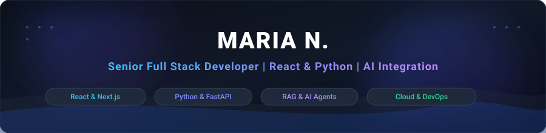

  

  
  
  
  

 

### 👋 Hi, I'm Maria N.

I am a **Senior Full Stack Developer** with 5+ years of experience building scalable web applications, backend systems, APIs, SaaS products, and AI-powered solutions.

My core strength is combining **Python and React** to build complete, production-ready applications — from responsive and intuitive frontend experiences to scalable backend services, APIs, databases, cloud infrastructure, and intelligent AI workflows. I enjoy solving complex engineering problems and turning ideas into reliable, high-performance products that solve real business problems.

---

## ⚡ What I Do

### 💻 Frontend Development
I build modern, responsive, and scalable user interfaces using:  
`React.js` `Next.js` `TypeScript` `JavaScript` `HTML5` `CSS3` `Tailwind CSS`  
*Focus*: Component-based architecture, reusable UI systems, state management, performance optimization, and seamless API integration.

### 🐍 Python & Backend Engineering
Python is one of my primary backend technologies. I build robust backend systems, APIs, microservices, and automation workflows using:  
`Python` `FastAPI` `Node.js` `Express.js` `NestJS` `REST APIs` `GraphQL`  
*Focus*: Authentication (OAuth 2.0, JWT), webhooks, background jobs, scheduled workflows, validation, error handling, and production support.

### 🤖 AI & Generative AI
I bring AI from experimentation into real production applications:  
`OpenAI API` `Anthropic Claude` `LLMs` `Generative AI` `RAG` `AI Agents` `LangChain` `LangGraph` `Embeddings` `Vector Databases` `Semantic Search` `Prompt Engineering` `Tool Calling` `Function Calling`  
*Focus*: AI-powered assistants, knowledge-based applications, document intelligence solutions, semantic search systems, and agentic workflows.

### 🔍 RAG & Intelligent Search
I build systems that allow applications to work with private and domain-specific knowledge using:  
`Retrieval-Augmented Generation (RAG)` `Vector Search (Qdrant, Pinecone)` `Semantic Search` `Knowledge Bases` `Hybrid Reranking`  
*The goal*: Make AI applications grounded, accurate, and relevant with zero hallucination.

### 🗄️ Databases & Data
`PostgreSQL` `MongoDB` `Redis` `MySQL` `SQL` `Snowflake` `Azure Data Lake`  
*Focus*: Database design, data modeling, query optimization, structured data processing, and caching.

### ☁️ Cloud & DevOps
`AWS` `Docker` `Git` `GitHub Actions` `CI/CD` `Kubernetes` `Helm` `Prometheus` `Grafana`  
*Focus*: Building systems that are reliable, maintainable, secure, observable, and scalable.

---

## 🛠️ Visual Tech Matrix

  <!-- Frontend -->
  
  
  
  
  
   
  <!-- Backend -->
  
  
  
  
  
  
   
  <!-- AI / GenAI -->
  
  
  
  
  
   
  <!-- Databases & Cloud -->
  
  
  
  
  
  

---

## 📈 Real Business Impact & Metrics

  
  
  
  

 

| Operational Area | Impact Metric | Engineering Highlight |
| :--- | :---: | :--- |
| **Enterprise Web Applications** | `15+ Shipped` | Scalable React, Next.js, and FastAPI platforms across production environments |
| **API Integrations & Webhooks** | `20+ Delivered` | Robust OAuth 2.0/JWT authentication, background jobs, and error recovery logic |
| **Business Task Automation** | `10+ Tasks` | End-to-end AI agent tool calling, function calling, and automated routing |
| **Knowledge Retrieval & RAG** | `500+ Docs` | High-relevance vector search, semantic embeddings, and zero-hallucination pipelines |
| **Manual Lookup Reduction** | `40% Saved` | AI assistants and intelligent document lookup cutting research overhead |
| **Database Performance** | `35% Faster` | Query optimization, indexing, and Redis distributed caching for PostgreSQL & MongoDB |
| **Production System Reliability**| `99.5% Uptime` | Docker containerization, CI/CD automated test gates, and Prometheus monitoring |

---

## 🏆 Featured Production Systems

### 🤖 1. Agentic AI & Intelligent RAG Systems

* **Agentic Workflow Automation Engine** *(2024)*  
  Production AI agent engine utilizing tool calling, function calling, intelligent routing, and automated decision-making.  
  `Python` `FastAPI` `OpenAI API` `LangChain` `Celery` `PostgreSQL` `Redis` `Docker`

* **Enterprise Grounded RAG & Semantic Search API** *(2024)*  
  High-precision document retrieval pipeline integrating OpenAI embeddings, Qdrant vector database, and hybrid cross-encoder reranking.  
  `Python` `FastAPI` `Next.js` `Qdrant` `Cohere Rerank` `Hybrid Search` `Docker`

* **Autonomous Multi-Agent Task Orchestrator** *(2023 – 2024)*  
  Multi-agent collaboration graph orchestrating specialized researcher, coder, and supervisor agents with Redis queues.  
  `Python` `FastAPI` `LangGraph` `Anthropic Claude` `Redis` `Pydantic` `Pytest`

* **AI Customer Support Assistant Platform** *(2024 – 2025)*  
  Full-stack support platform with real-time WebSocket streaming, Claude 3.5 Sonnet, and persistent vector memory.  
  `React` `FastAPI` `WebSockets` `Claude 3.5 Sonnet` `Vector Memory` `PostgreSQL`

---

### 💻 2. Full-Stack Applications & API Gateways

* **Full-Stack SaaS Document Intelligence Platform** *(2023)*  
  End-to-end SaaS application enabling AI-powered document search and knowledge extraction across 500+ documents.  
  `React` `Next.js` `TypeScript` `FastAPI` `Qdrant` `PyPDF` `PostgreSQL`

* **Event-Driven Microservices API Gateway** *(2022)*  
  High-throughput API gateway and transaction router with OAuth 2.0, JWT, GraphQL, and Redis caching.  
  `Node.js` `Express` `TypeScript` `GraphQL` `MongoDB` `Redis` `JWT` `OAuth 2.0`

* **High-Concurrency RESTful Backend API** *(2021 – 2022)*  
  Sub-50ms database-driven microservice engineered for high-concurrency request loads and background task dispatch.  
  `Python` `FastAPI` `PostgreSQL` `Redis Caching` `Celery` `Docker` `SQLAlchemy`

* **Enterprise SaaS Analytics Dashboard** *(2022)*  
  Responsive analytics interface connecting frontend experiences with backend databases and CRM platforms.  
  `React 18` `Next.js 14` `TypeScript` `Tailwind CSS` `TanStack Query` `Chart.js`

---

### ☁️ 3. Cloud Data Lakehouse & Infrastructure

* **Cloud Lakehouse ETL/ELT Streaming Pipeline** *(2024 – 2025)*  
  Scalable data platform across Azure Synapse, Snowflake, and lakehouse environments with automated dbt models.  
  `Python` `PySpark` `Snowflake` `dbt` `Azure Synapse` `Docker`

* **Enterprise Cloud-Native AI Platform Infrastructure** *(2025 – 2026)*  
  Production GitOps CI/CD, Kubernetes (EKS) orchestration, Prometheus observability, and automated canary rollouts.  
  `Docker` `Kubernetes` `AWS EKS` `Helm` `GitHub Actions` `Prometheus` `Grafana`

---

## 💼 Professional Experience

### **Senior Full Stack Developer** | **FORCE CLOUD** *(Jan 2024 – Present)*
- Scaled data platforms and ETL/ELT pipelines across Azure Data Lake, Snowflake, and lakehouse architectures.
- Shipped 15+ production web applications and backend services with Python, TypeScript, React, and Next.js.
- Integrated OpenAI and Anthropic Claude APIs to build AI assistants, RAG pipelines, and automated tool-calling agent workflows.
- Supported 5+ production AI use cases with **99.5% uptime**.

### **Full Stack Developer** | **Alphabet** *(Jul 2021 – Jan 2024)*
- Developed 15+ web application features and backend microservices with FastAPI, Node.js, and React.
- Built RAG and semantic-search capabilities across 500+ documents, improving relevance by **30%**.
- Orchestrated 10+ AI agent workflows with tool calling, function calling, and automated routing.
- Designed database solutions with PostgreSQL, MongoDB, and Redis, reducing query response time by **30%**.

---

## 🎓 Education

**Bachelor of Science in Computer Science (BS CS)**  
*COMSATS University, Lahore Campus (2017 – 2021)*

---

## 📬 Connect With Me

  
  
  

 

  <i>Build. Ship. Scale. Make it Intelligent.</i>

