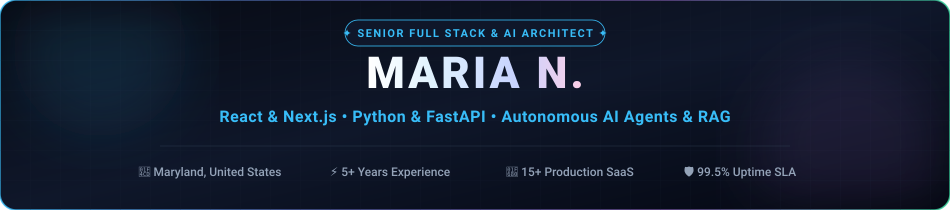
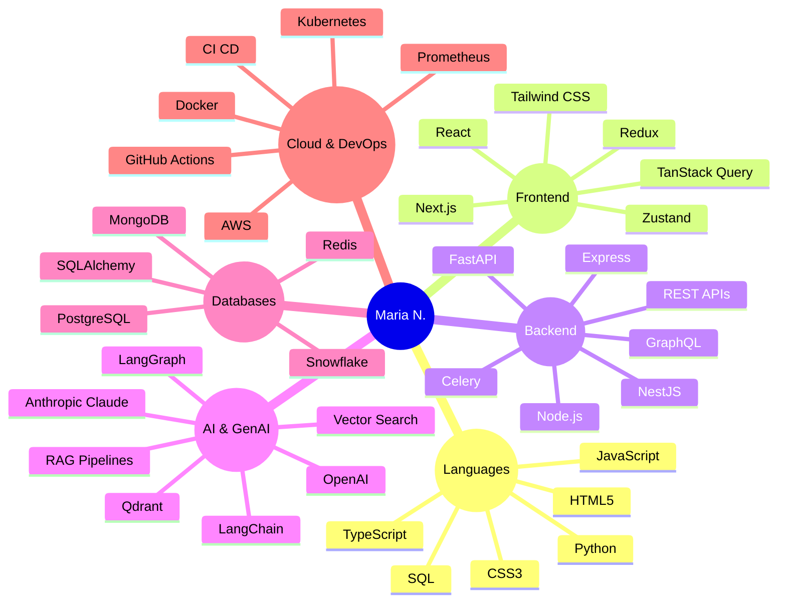

<div align="center">
  
</div>

<br/>

<div align="center">
  <a href="mailto:maria.n.110595@gmail.com">
    
  </a>
  &nbsp;
  <a href="https://linkedin.com">
    
  </a>
  &nbsp;
  <a href="https://github.com/coding-marian">
    
  </a>
  &nbsp;
  
</div>

<br/>

# 👋 Hi, I'm Maria N.

### 💻 Senior Full Stack Developer | Python • React • AI • Generative AI

Senior Full Stack Developer with **5+ years of experience** building scalable web applications, SaaS products, microservices, and AI-powered solutions.

My core strength is combining **Python and React** to build complete, production-ready systems — from responsive and intuitive frontend interfaces to distributed backend microservices, high-throughput APIs, cloud infrastructure, and autonomous AI workflows. I integrate **OpenAI, Anthropic Claude, LangGraph, RAG, and vector search** into real-world business applications, maintaining a proven **99.5% production SLA**.

---

### ⚡ Key Performance & Engineering Highlights

<div align="center">

| 🚀 15+ | ⚡ &lt;50ms | 🤖 10+ | 🎯 +30% | 📈 99.5% |
| :---: | :---: | :---: | :---: | :---: |
| **Shipped Production Apps** | **Microservice API Latency** | **Automated AI Workflows** | **Retrieval Accuracy Boost** | **Production SLA Uptime** |

</div>

---

### 🧠 Tech Snapshot



---

### 🚀 What I Do

#### ⚛️ Frontend Engineering
I build modern, responsive, and scalable user interfaces using **React.js, Next.js, TypeScript, JavaScript, HTML5, CSS3, and Tailwind CSS**.  
* Focus on component-based architecture, reusable UI systems, and responsive layouts.  
* Client-side and server-side state management (TanStack Query, Zustand), frontend performance optimization, and seamless REST/GraphQL API integration.

#### 🐍 Python & Backend Architecture
Python is my primary backend language. I build robust backend systems, APIs, microservices, and automation workflows using **Python, FastAPI, Node.js, Express.js, and NestJS**.  
* Sub-50ms RESTful microservices, OAuth 2.0, JWT authentication, and RBAC security.  
* Asynchronous request handling, webhooks, background queues (Celery/Redis), rate-limiting, and resilient error handling.

#### 🤖 Agentic AI & Autonomous Workflows
Bringing AI from experimentation into real production applications:  
* Build AI assistants, multi-agent workflows, and automated decision loops using **OpenAI, Anthropic Claude, LangGraph, and LangChain**.  
* Advanced prompt engineering, structured JSON function calling, tool calling, and streaming token responses.

#### 🧠 RAG & Semantic Retrieval
Grounding AI applications in private, domain-specific knowledge:  
* Build retrieval pipelines using **Retrieval-Augmented Generation (RAG), vector embeddings, semantic search, and knowledge bases**.  
* Hybrid reranking (Reciprocal Rank Fusion) combining dense vector search (Qdrant) with lexical BM25 over 500+ private enterprise documents to eliminate hallucinations.

#### 🗄️ Databases & High-Throughput Caching
Data modeling, persistence, and caching:  
* Work with **PostgreSQL, MongoDB, Redis, MySQL, SQL, and Snowflake**.  
* Relational database design, query optimization, and distributed Redis caching, reducing query latency by **35%**.

#### ☁️ Cloud Native & DevOps Infrastructure
Production engineering for reliability and scale:  
* Deploy with **AWS, Docker, Kubernetes, Git, GitHub Actions, and CI/CD pipelines**.  
* Observability with Prometheus and Grafana, maintaining **99.5% uptime SLA**.

---

### 📊 Measured Impact Across Projects

* 🚀 **15+** Production web applications and backend services shipped
* 🔌 **20+** Enterprise REST API integrations delivered across third-party ecosystems
* 🤖 **10+** Repetitive business workflows fully automated with AI agents
* 🧠 **5+** Production AI use cases deployed with **99.5% uptime**
* 📚 **500+** Documents enabled with semantic search and intelligent retrieval
* 🎯 **30%** Improvement in AI retrieval accuracy and relevance
* ⚡ **40%** Reduction in manual research and lookup time
* 🗄️ **35%** Optimization in database query response times
* 🔐 **Zero-Trust** authentication and security implemented across all services

---

### 💼 Professional Experience

#### **Senior Full Stack Developer** | **FORCE CLOUD** *(Jan 2024 – Present)*
* Scaled data platforms and ETL/ELT pipelines across Azure Data Lake, Snowflake, and lakehouse architectures with dbt.
* Shipped 15+ production web applications and backend services with Python, TypeScript, React, and Next.js.
* Integrated OpenAI and Anthropic Claude APIs to build AI assistants, RAG pipelines, and automated tool-calling agent workflows.
* Supported 5+ production AI use cases with **99.5% uptime**.

#### **Full Stack Developer** | **Alphabet** *(Jul 2021 – Jan 2024)*
* Developed 15+ web application features and backend microservices with FastAPI, Node.js, and React.
* Built RAG and semantic-search capabilities across 500+ documents, improving relevance by **30%**.
* Orchestrated 10+ AI agent workflows with tool calling, function calling, and automated routing.
* Designed database solutions with PostgreSQL, MongoDB, and Redis, reducing query response time by **35%**.

---

### 🎓 Education

**Bachelor of Science in Computer Science (BS CS)**  
*COMSATS University, Lahore Campus (2017 – 2021)*

---

### 💡 How I Think About Engineering

```
Problem  ──▶  Architecture  ──▶  Implementation  ──▶  Optimization  ──▶  Production
```

Creating software that is **fast, scalable, secure, maintainable, intelligent, and production-ready**.

---

### 📬 Connect With Me

<div align="center">
  <a href="mailto:maria.n.110595@gmail.com">
    
  </a>
  &nbsp;
  <a href="https://linkedin.com">
    
  </a>
  &nbsp;
  <a href="https://github.com/coding-marian">
    
  </a>
</div>

<br/>

<div align="center">
  <i>🚀 Build. Ship. Scale. Make it Intelligent.</i>
</div>
