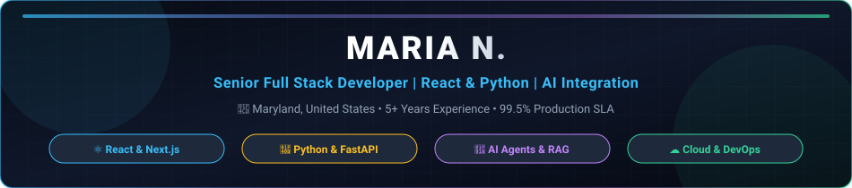

<div align="center">
  
</div>

<br/>

<div align="center">
  <a href="mailto:maria.n.110595@gmail.com">
    
  </a>
  <a href="https://linkedin.com">
    
  </a>
  <a href="https://github.com/coding-marian">
    
  </a>
  
</div>

<br/>

# 👋 Hi, I'm Maria N.

### 💻 Senior Full Stack Developer | Python • React • AI • Generative AI

I’m a **Senior Full Stack Developer** with **5+ years of experience** building scalable web applications, backend systems, APIs, SaaS products, and AI-powered solutions.

My core strength is combining **Python** and **React** to build complete, production-ready applications — from responsive and intuitive frontend experiences to scalable backend services, APIs, databases, cloud infrastructure, and intelligent AI workflows.

I enjoy solving complex engineering problems and turning ideas into reliable, high-performance products that solve real business problems.

---

## 🚀 What I Do

### ⚛️ Frontend Development
I build modern, responsive, and scalable user interfaces using:
> `React.js` • `Next.js` • `TypeScript` • `JavaScript` • `HTML5` • `CSS3` • `Tailwind CSS`

* Focus on component-based architecture, reusable UI design systems, and responsive layouts.
* Advanced client-side and server-side state management (TanStack Query, Zustand, React Context).
* Frontend performance optimization, code splitting, dynamic routing, and seamless REST/GraphQL API integration.

### 🐍 Python & Backend Engineering
Python is one of my primary backend technologies:
> `Python` • `FastAPI` • `Node.js` • `Express.js` • `NestJS` • `REST APIs` • `GraphQL`

* High-throughput asynchronous backend services and sub-50ms RESTful microservices.
* Enterprise authentication and security: OAuth 2.0, JWT, RBAC, webhooks, and rate-limiting.
* Background job orchestration (Celery, Redis queues), scheduled pipelines, comprehensive input validation, and resilient error handling.

### 🤖 AI & Generative AI
Bringing AI from experimentation into real production applications:
> `OpenAI` • `Anthropic Claude` • `LLMs` • `Generative AI` • `RAG` • `AI Agents` • `LangChain` • `LangGraph` • `Embeddings` • `Vector Databases` • `Semantic Search` • `Prompt Engineering` • `Tool Calling` • `Function Calling`

* Built autonomous multi-agent systems with tool calling, function calling, dynamic loop execution, and intelligent supervisor routing.
* Engineered streaming token interfaces for instant conversational response times.

### 🧠 RAG & Intelligent Search
Systems that allow applications to ground answers with private and domain-specific knowledge:
> `Retrieval-Augmented Generation (RAG)` • `Embeddings` • `Vector Search` • `Semantic Search` • `Knowledge Bases` • `Retrieval Pipelines` • `Intelligent Document Retrieval`

* Implemented Reciprocal Rank Fusion (RRF) hybrid reranking combining dense vector search (Qdrant) with lexical BM25.
* Indexed 500+ private enterprise documents with semantic chunking, improving retrieval accuracy by **30%** and preventing hallucinations.

### 🗄️ Databases & Data Engineering
Robust data modeling, persistence, and caching:
> `PostgreSQL` • `MongoDB` • `Redis` • `MySQL` • `SQL` • `Snowflake` • `dbt` • `PySpark`

* Relational and document data modeling, query optimization, and schema migrations.
* Distributed Redis caching, session storage, and mutex locking, reducing query response times by **35%**.

### ☁️ Cloud & DevOps Infrastructure
Production engineering for security, observability, and high availability:
> `AWS` • `Docker` • `Kubernetes` • `Git & GitHub` • `CI/CD` • `Prometheus` • `Grafana`

* Containerized microservices, multi-stage Docker builds, and zero-downtime rolling updates.
* Automated GitHub Actions CI/CD deployment pipelines supporting production systems with **99.5% uptime**.

---

## 🛠️ My Core Stack

| Category | Technologies & Tools |
| :--- | :--- |
| **Frontend** | `React.js` `Next.js` `TypeScript` `JavaScript` `HTML5` `CSS3` `Tailwind CSS` `TanStack Query` |
| **Backend & APIs** | `Python` `FastAPI` `Node.js` `Express.js` `NestJS` `RESTful APIs` `GraphQL` `OAuth 2.0` `JWT` |
| **AI & Generative AI** | `OpenAI API` `Anthropic Claude` `LangGraph` `LangChain` `RAG` `AI Agents` `Tool Calling` |
| **Vector & Search** | `Qdrant` `ChromaDB` `Dense Embeddings` `Semantic Search` `RRF Hybrid Reranking` |
| **Databases & Cache** | `PostgreSQL` `MongoDB` `Redis` `MySQL` `Snowflake` `SQLAlchemy` |
| **Cloud & DevOps** | `AWS (EKS, S3, EC2)` `Docker` `Kubernetes` `Git` `GitHub Actions` `CI/CD` `Prometheus` |

---

## 📊 Building Software With Real Impact

Throughout my professional career across **FORCE CLOUD** and **Alphabet**, I have delivered measured engineering outcomes:

* 🚀 **15+** Production web applications and distributed backend services built and shipped.
* 🔌 **20+** Enterprise REST API integrations delivered across third-party SaaS ecosystems.
* 🤖 **10+** Repetitive business workflows fully automated via intelligent agent pipelines.
* 🧠 **5+** Production AI use cases deployed with **99.5% uptime SLA**.
* 📚 **500+** Documents indexed with semantic vector search for private enterprise intelligence.
* 🎯 **30%** Boost in AI retrieval accuracy and relevance, eliminating hallucinations.
* ⚡ **40%** Reduction in manual research, lookup, and triage time.
* 🗄️ **35%** Improvement in database query performance via indexing and Redis caching.
* 🔐 **100%** Secure authentication and authorization workflows implemented (OAuth 2.0, JWT, RBAC).

---

## 💼 Professional Experience

### **Senior Full Stack Developer** | **FORCE CLOUD** *(Jan 2024 – Present)*
* Scaled data platforms and ETL/ELT pipelines across Azure Data Lake, Snowflake, and lakehouse architectures with dbt.
* Shipped 15+ production web applications and backend services with Python, TypeScript, React, and Next.js.
* Integrated OpenAI and Anthropic Claude APIs to build AI assistants, RAG pipelines, and automated tool-calling agent workflows.
* Supported 5+ production AI use cases with **99.5% uptime**.

### **Full Stack Developer** | **Alphabet** *(Jul 2021 – Jan 2024)*
* Developed 15+ web application features and backend microservices with FastAPI, Node.js, and React.
* Built RAG and semantic-search capabilities across 500+ documents, improving relevance by **30%**.
* Orchestrated 10+ AI agent workflows with tool calling, function calling, and automated routing.
* Designed database solutions with PostgreSQL, MongoDB, and Redis, reducing query response time by **35%**.

---

## 🎓 Education

**Bachelor of Science in Computer Science (BS CS)**  
*COMSATS University, Lahore Campus (2017 – 2021)*

---

## 💡 How I Think About Engineering

I don't believe in building technology simply because it's possible.

<div align="center">

```
Problem  ───▶  Architecture  ───▶  Implementation  ───▶  Optimization  ───▶  Production
```

</div>

Whether I'm building a React frontend, a Python/FastAPI backend, an AI agent, a RAG pipeline, or a complete full-stack platform, I aim to create software that is:
* ⚡ **Fast**
* 📈 **Scalable**
* 🔐 **Secure**
* 🧩 **Maintainable**
* 🧠 **Intelligent**
* 🛠️ **Production-ready**

---

## 🌱 Currently Exploring

* **Agentic AI & Multi-Agent Loops** (LangGraph, Supervisor patterns, self-correcting agents)
* **Advanced RAG Architectures** (Contextual retrieval, hybrid dense/sparse reranking)
* **Scalable Full-Stack AI Systems** (Real-time token streaming, edge inference)

---

## 🤝 Let's Build Something

I'm always interested in interesting engineering problems, AI projects, open-source collaboration, and opportunities to build technology that actually makes an impact.

If you're working on something involving **Python**, **React**, **Full Stack Development**, **Generative AI**, **RAG**, or **AI Agents**, I'd love to connect.

<br/>

<div align="center">
  <a href="mailto:maria.n.110595@gmail.com">
    
  </a>
  <a href="https://linkedin.com">
    
  </a>
  <a href="https://github.com/coding-marian">
    
  </a>
</div>

<br/>

<div align="center">
  <i>🚀 Build. Ship. Scale. Make it Intelligent.</i>
</div>
