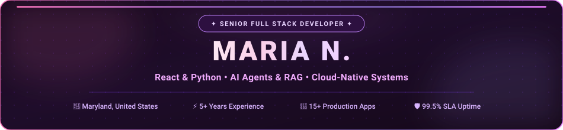
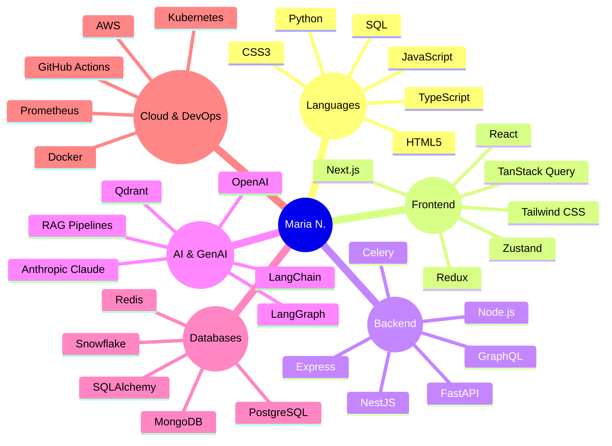

  

 

&nbsp;
&nbsp;
&nbsp;

 

# 👋 Hi, I'm Maria N.

### 💜 Senior Full Stack Developer | React · Python · AI Integration

I'm a **Senior Full Stack Developer** with **5+ years of experience** building production-ready web applications, distributed backend services, SaaS platforms, and intelligent AI systems.

My strength lies in combining **Python + React** across the full stack — connecting responsive, pixel-perfect frontends to high-throughput backend microservices, vector-powered AI workflows, and cloud-native infrastructure. I deliver **99.5% SLA** systems that integrate **OpenAI, Anthropic Claude, LangGraph, RAG, and autonomous agents** into real-world business applications.

---

### 🎯 Key Engineering Highlights

| 🚀 | ⚡ | 🤖 | 🧠 | 📈 |
|:---:|:---:|:---:|:---:|:---:|
| **15+ Production Apps** | **<50ms API Latency** | **10+ AI Workflows** | **30% Better Retrieval** | **99.5% Uptime SLA** |

---

### 🛠️ Tech Snapshot

---

### 💼 What I Build

#### ⚛️ Frontend Engineering
Modern, responsive, scalable interfaces using **React 19, Next.js 15, TypeScript, JavaScript, HTML5, CSS3, and Tailwind CSS**.  
Component-based architecture · reusable design systems · server-side rendering · seamless REST/GraphQL integration.

#### 🐍 Python & Backend Systems
High-performance APIs and microservices using **Python, FastAPI, Node.js, Express.js, and NestJS**.  
Sub-50ms request handling · OAuth 2.0 & JWT auth · background task queues (Celery/Redis) · webhooks & integrations.

#### 🤖 Agentic AI & GenAI Workflows
Production autonomous AI systems using **OpenAI, Anthropic Claude, LangGraph, and LangChain**.  
Multi-agent supervisor loops · function calling · JSON tool routing · real-time token streaming.

#### 🧠 RAG & Semantic Retrieval
Private knowledge grounding using **vector embeddings, Qdrant, Hybrid RRF Reranking, and semantic search**.  
500+ enterprise documents indexed · hallucination-free retrieval · 30% accuracy improvement.

#### 🗄️ Databases & Caching
Reliable persistence at scale using **PostgreSQL, MongoDB, Redis, MySQL, and Snowflake**.  
Relational modeling · query optimization · distributed caching · 35% latency reduction.

#### ☁️ Cloud & Platform Infrastructure
99.5% SLA systems using **AWS, Docker, Kubernetes, GitHub Actions, Prometheus, and Grafana**.  
Multi-stage builds · zero-downtime rolling updates · full CI/CD automation.

---

### 📊 Proven Delivery Record

| Metric | Outcome |
| :--- | :--- |
| 🚀 Web Applications & Backend Services | **15+** shipped to production |
| 🔌 Enterprise REST API Integrations | **20+** delivered |
| 🤖 AI Workflows Automated | **10+** live pipelines |
| 🧠 Production AI Use Cases | **5+** at 99.5% uptime |
| 📚 Documents Indexed in RAG | **500+** private documents |
| 🎯 Retrieval Accuracy Boost | **+30%** over baseline |
| ⚡ Research & Lookup Time Saved | **−40%** manual effort |
| 🗄️ Database Query Latency | **−35%** via indexing & caching |

---

### 💼 Career Timeline

**Senior Full Stack Developer** — **FORCE CLOUD** *(Jan 2024 – Present)*
> Scalable ETL pipelines · AI SaaS platforms · 15+ web apps · OpenAI & Claude integration · 99.5% uptime

**Full Stack Developer** — **Alphabet** *(Jul 2021 – Jan 2024)*
> RAG systems · 500+ document intelligence · 10+ agent workflows · FastAPI microservices · 35% DB optimization

---

### 🎓 Education

**BS Computer Science** — *COMSATS University, Lahore Campus (2017 – 2021)*

---

### 🌱 Currently Exploring

- Agentic AI (LangGraph supervisor loops, self-correcting multi-agent systems)
- Advanced RAG (contextual retrieval, hybrid dense/sparse reranking)
- Real-time AI streaming (WebSocket token delivery, edge inference)

---

&nbsp;

 

  <i>💜 Build. Ship. Scale. Make it Intelligent.</i>

