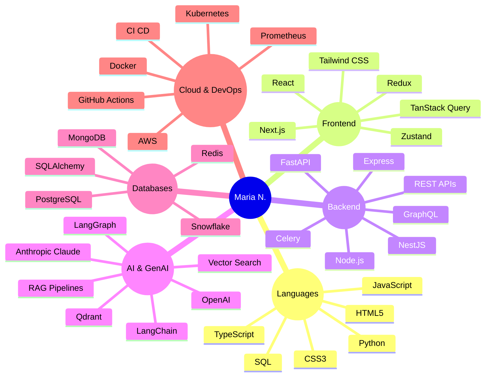

# 👋 Hi, I'm Maria N.  
### 💻 Senior Full Stack Developer | React & Python | AI Integration  
**📍 Maryland, United States**  

Senior Full Stack Developer with **5+ years of experience** building scalable web applications, SaaS products, APIs, and AI-powered solutions using **React, Next.js, TypeScript, Python, FastAPI, PostgreSQL, MongoDB, AWS, and Docker**.

I combine **Python and React** to build complete, production-ready applications — from responsive and intuitive frontend interfaces to scalable backend services, distributed APIs, databases, cloud infrastructure, and intelligent AI workflows. I integrate **OpenAI, Anthropic Claude, LLMs, RAG, and AI Agents** into real-world business workflows, focused on building secure, scalable, high-performance systems with **99.5% uptime**.

---

### 🧠 Tech Snapshot



---

### 🚀 What I Do

#### ⚛️ Frontend Development
I build modern, responsive, and scalable user interfaces using **React.js, Next.js, TypeScript, JavaScript, HTML5, CSS3, and Tailwind CSS**.  
* Focus on component-based architecture, reusable UI systems, and responsive layouts.  
* Client-side and server-side state management, frontend performance optimization, and seamless REST/GraphQL API integration.

#### 🐍 Python & Backend Engineering
Python is my primary backend language. I build robust backend systems, APIs, microservices, and automation workflows using **Python, FastAPI, Node.js, Express.js, and NestJS**.  
* Sub-50ms RESTful microservices, OAuth 2.0, JWT authentication, and RBAC security.  
* Asynchronous request handling, webhooks, background tasks (Celery/Redis), rate-limiting, and error handling.

#### 🤖 AI & Generative AI
Bringing AI from experimentation into production systems:  
* Build AI assistants, multi-agent workflows, and automated decision loops using **OpenAI, Anthropic Claude, LangGraph, and LangChain**.  
* Advanced prompt engineering, structured JSON function calling, tool calling, and streaming token responses.

#### 🧠 RAG & Intelligent Search
Grounding AI applications in private, domain-specific knowledge:  
* Build retrieval pipelines using **Retrieval-Augmented Generation (RAG), vector embeddings, semantic search, and knowledge bases**.  
* Hybrid reranking (Reciprocal Rank Fusion) combining dense vector search (Qdrant) with lexical BM25 over 500+ private enterprise documents to eliminate hallucinations.

#### 🗄️ Databases & Data Systems
Data modeling, persistence, and caching:  
* Work with **PostgreSQL, MongoDB, Redis, MySQL, SQL, and Snowflake**.  
* Database design, query optimization, and distributed Redis caching, reducing query latency by **35%**.

#### ☁️ Cloud & DevOps Infrastructure
Production engineering for reliability and scale:  
* Deploy with **AWS, Docker, Kubernetes, Git, GitHub Actions, and CI/CD pipelines**.  
* Observability with Prometheus and Grafana, maintaining **99.5% uptime SLA**.

---

### 📊 Proven Impact & Key Metrics

* 🚀 **15+** Production web applications and backend services shipped
* 🔌 **20+** Enterprise REST API integrations delivered
* 🤖 **10+** Repetitive business workflows fully automated with AI agents
* 🧠 **5+** Production AI use cases deployed with **99.5% uptime**
* 📚 **500+** Documents enabled with semantic search and intelligent retrieval
* 🎯 **30%** Improvement in AI retrieval accuracy and relevance
* ⚡ **40%** Reduction in manual research and lookup time
* 🗄️ **35%** Optimization in database query response times
* 🔐 **Zero-Trust** authentication and security implemented across all services

---

### 💼 Professional Experience

#### **Senior Full Stack Developer** | **FORCE CLOUD** *(Jan 2024 – Present)*
* Scaled data platforms and ETL/ELT pipelines across Azure Data Lake, Snowflake, and lakehouse architectures.
* Shipped 15+ production web applications and backend services with Python, TypeScript, React, and Next.js.
* Integrated OpenAI and Anthropic Claude APIs to build AI assistants, RAG pipelines, and automated tool-calling agent workflows.
* Supported 5+ production AI use cases with **99.5% uptime**.

#### **Full Stack Developer** | **Alphabet** *(Jul 2021 – Jan 2024)*
* Developed 15+ web application features and backend microservices with FastAPI, Node.js, and React.
* Built RAG and semantic-search capabilities across 500+ documents, improving relevance by **30%**.
* Orchestrated 10+ AI agent workflows with tool calling, function calling, and automated routing.
* Designed database solutions with PostgreSQL, MongoDB, and Redis, reducing query response time by **35%**.

---

### 🎓 Education

**Bachelor of Science in Computer Science (BS CS)**  
*COMSATS University, Lahore Campus (2017 – 2021)*

---

### 💡 How I Think About Engineering

I focus on a disciplined engineering lifecycle:

```
Problem  ──▶  Architecture  ──▶  Implementation  ──▶  Optimization  ──▶  Production
```

Creating software that is **fast, scalable, secure, maintainable, intelligent, and production-ready**.

---

### 📬 Connect With Me

- 💼 [LinkedIn](https://linkedin.com)
- 🐙 [GitHub](https://github.com/coding-marian)
- ✉️ **[maria.n.110595@gmail.com](mailto:maria.n.110595@gmail.com)**
- 📍 Maryland, United States

<br/>

*Thanks for visiting! ✨ Let's build something awesome together.*
