<div align="center">

  <!-- Animated Angry Birds Tech Banner -->
  <a href="https://coding-marian.github.io/tech-birds-game/">
    
  </a>

  <br/><br/>

  <!-- Interactive Game & Profile Badges -->
  <a href="https://coding-marian.github.io/tech-birds-game/">
    
  </a>
  <a href="https://coding-marian.github.io/tech-birds-game/">
    
  </a>

  <br/><br/>

  <!-- Contact & Info Badges -->
  <a href="mailto:maria.n.110595@gmail.com">
    
  </a>
  <a href="https://linkedin.com">
    
  </a>
  <a href="https://github.com/coding-marian">
    
  </a>
  

</div>

<br/>

## 👋 Hi, I'm Maria N.

### 💜 Senior Full Stack Developer | Python • React • AI Agents • RAG

I'm a **Senior Full Stack Developer** with **5+ years of experience** building scalable web applications, backend systems, APIs, SaaS products, and AI-powered solutions.

My core strength is combining **Python** and **React** to build complete, production-ready applications — from responsive and intuitive frontend experiences to scalable backend microservices, APIs, databases, cloud infrastructure, and intelligent AI workflows.

---

### 🎮 The Interactive Tech Showcase

> **Try the game live:** Pull back the slingshot and smash the tech blocks to unlock skills, metrics, and production achievements! Or toggle **Pretty Birds Mode** to watch Red, Chuck, and Stella jump around and bounce across the stack!
> 
> 👉 **[Launch the Angry Tech Birds Web Game](https://coding-marian.github.io/tech-birds-game/)**

| Character | Ability | Tech Smash Target |
| :--- | :--- | :--- |
| **🔴 Red Bird** | High mass, crushing impact | Core Foundations (React & Python) |
| **🟡 Chuck (Speed)** | Supersonic Turbo Boost mid-air | High-Speed Microservices (FastAPI & Redis) |
| **🌸 Stella (Pink)** | Anti-Gravity Pink Bubble Field | Complex AI Architectures (RAG & AI Agents) |

---

## 🚀 What I Do

### ⚛️ Frontend Development
I build modern, responsive, and scalable user interfaces using:  
`React.js` • `Next.js` • `TypeScript` • `JavaScript` • `HTML5` • `CSS3` • `Tailwind CSS`

- Component-based modular architecture & design systems
- High-performance state management & SSR hydration
- Seamless REST & WebSocket API integrations

### 🐍 Python & Backend Engineering
Python is my primary backend technology. I build robust systems, microservices, and automation workflows using:  
`Python` • `FastAPI` • `Node.js` • `Express.js` • `NestJS` • `REST APIs` • `GraphQL`

- Enterprise authentication (OAuth 2.0, JWT, RBAC)
- Scalable microservices, webhooks & background workers
- Database query optimization and distributed caching

### 🤖 AI & Generative AI
Bringing artificial intelligence from experimentation into real production applications:  
`OpenAI` • `Anthropic Claude` • `LLMs` • `RAG` • `AI Agents` • `LangChain` • `LangGraph` • `Vector DBs`

- Retrieval-Augmented Generation (RAG) across domain-specific data
- Autonomous agentic workflows with dynamic tool calling & function execution
- Semantic search & embedding retrieval pipelines

### 🗄️ Databases & Storage
`PostgreSQL` • `MongoDB` • `Redis` • `MySQL` • `SQL`

- Data modeling, schema migration, and relational query tuning
- High-throughput Redis caching layers

### ☁️ Cloud & DevOps
`AWS` • `Docker` • `Git` • `GitHub Actions` • `CI/CD`

- Containerized deployments with Docker & cloud orchestrations
- Automated CI/CD test and deployment pipelines

---

## 📊 Proven Engineering Impact

- 🚀 **15+ Production Apps** & backend systems built and deployed
- 🔌 **20+ REST & GraphQL API** integrations delivered
- 🤖 **10+ Business Workflows** fully automated
- 📚 **500+ Private Documents** indexed via AI RAG pipelines
- 🎯 **30% Accuracy Improvement** in AI semantic retrieval
- ⚡ **40% Reduction** in manual research and lookup time
- 🗄️ **35% Database Query Speedup** through schema & indexing tuning
- 📈 **99.5% SLA Uptime** sustained in production cloud environments

---

## 💡 How I Think About Engineering

```
Problem ➔ Architecture ➔ Implementation ➔ Optimization ➔ Production
```

Every line of code should deliver tangible value. Whether crafting an intuitive React UI, designing a FastAPI backend, or orchestrating a multi-agent RAG workflow, I build software that is:  
**⚡ Fast • 📈 Scalable • 🔐 Secure • 🧩 Maintainable • 🧠 Intelligent • 🛠️ Production-Ready**

---

## 🤝 Let's Build Something

I'm always excited to tackle challenging engineering problems, open-source projects, and full-stack AI initiatives.

- 📬 **Email:** [maria.n.110595@gmail.com](mailto:maria.n.110595@gmail.com)
- 💼 **LinkedIn:** [Connect on LinkedIn](https://linkedin.com)
- 💻 **GitHub:** [@coding-marian](https://github.com/coding-marian)

<br/>

<div align="center">
  <sub>🚀 Build. Ship. Scale. Make it Intelligent. • © Maria N.</sub>
</div>
